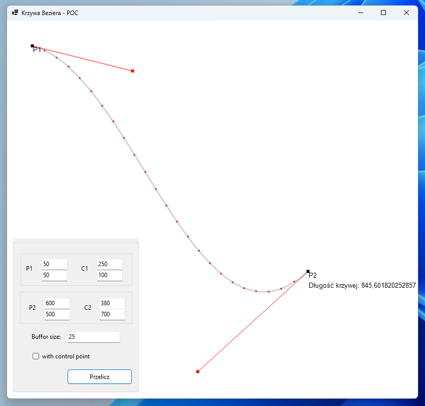

# Bezier curve

A POC-type application, it allows the user to manipulate the two points through which the Bézier curve passes and to move the control points. In addition, the application calculates the length of the Bézier curve. It is a tool written to experiment with counting methods and display the Bézier curve.

Features:
- Point manipulation: The user can add, remove and move points through which the Bézier curve passes. Two points are set as control points and the rest are interpolated from these points.

- Moving control points: Control points can be moved, making it possible to change the shape of the Bézier curve.

- Curve length calculation: The application includes a function for calculating the length of a Bézier curve, allowing the user to accurately determine the length of the selected curve.

  .Net / WinForm

 
